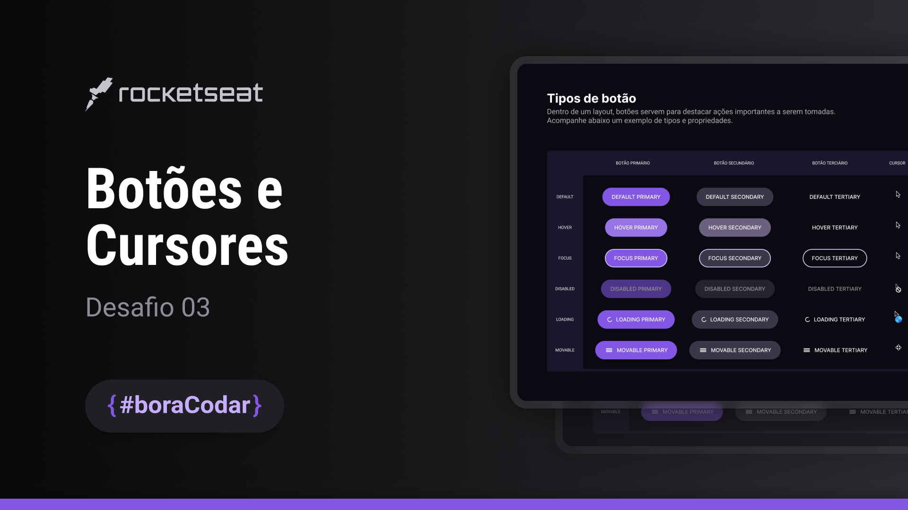
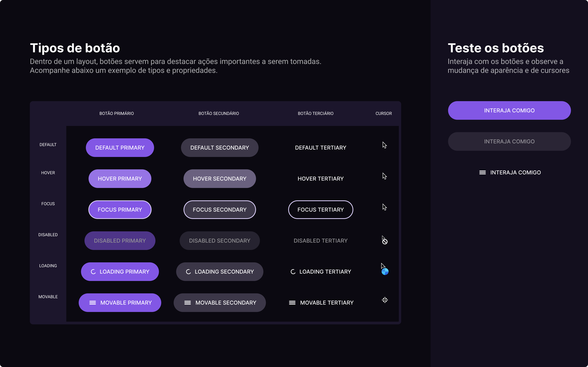

<h1 align="center" style="font-weight: bold;"> Buttons & Cursors </h1>

<!-- BADGES -->

  

<!-- MENU -->

  <a href="#-deploy">Deploy</a>&nbsp;&nbsp;|&nbsp;&nbsp;
  <a href="#-layout">Layout</a>&nbsp;&nbsp;|&nbsp;&nbsp;
  <a href="#-tecnologias">Tecnologias</a>&nbsp;&nbsp;|&nbsp;&nbsp;
  <a href="#-licença">Licença</a>

<!-- SHORT DESCRIPTION -->

  O Buttons & Cursors (botões e cursores) é uma tela de documentação de botões e cursores que possui uma área de pré visualização dos mesmos. Os botões podem ser utilizados em aplicações web ou mobile.

<!-- STATUS OR DEPLOY LINK -->

  🚀 Finalizado

<!-- EXAMPLE IMAGE COVER -->

  

## 🔗 Deploy

O deploy da aplicação pode ser acessada através do seguinte [link](https://pabloxt14-buttons-and-cursors.vercel.app/)

## 🎨 Layout

Você pode visualizar o layout do projeto através [DESSE LINK](https://www.figma.com/community/file/1197534710257750520). É necessário ter conta no [Figma](https://figma.com) para acessá-lo.

Veja uma demonstração visual das principais telas da aplicação:

  

## 🚀 Tecnologias

Esse projeto foi desenvolvido com as seguintes tecnologias:

- [TypeScript](https://www.typescriptlang.org/)
- [React + Vite](https://vitejs.dev/)
- [TailwindCSS](https://tailwindcss.com/)
- [Tailwind Merge](https://github.com/dcastil/tailwind-merge)
- [Tailwind Variants](https://www.tailwind-variants.org/docs/introduction)
- [Framer Motion](https://www.framer.com/motion/)

## 📝 Licença

Esse projeto está sob a licença MIT.

---

  Feito com 💙 por Pablo Alan

